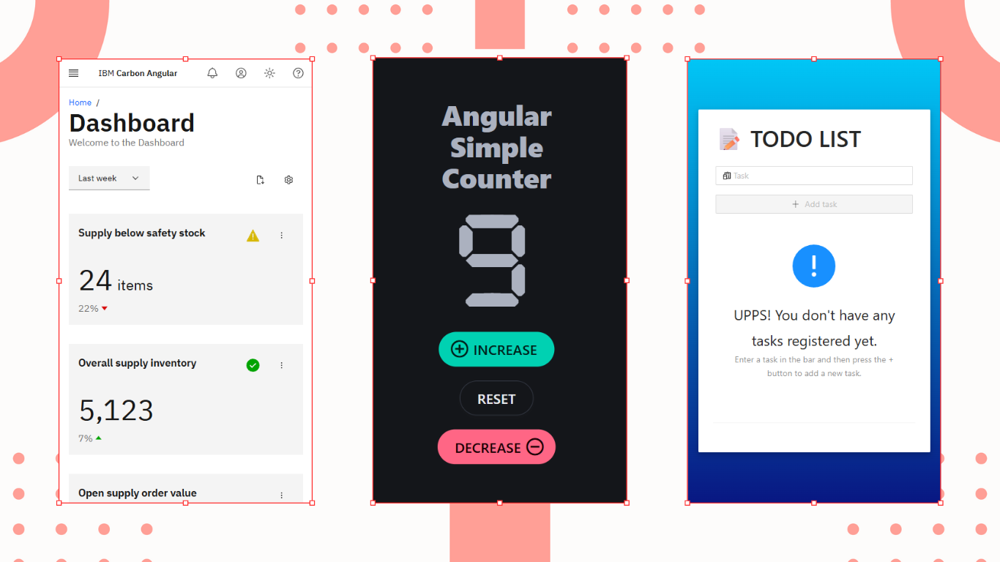

# Angular Challenges

This is a **monorepo** containing multiple Angular projects, each created using a different Angular version and UI library. These projects are designed to showcase various approaches and solutions to Angular challenges.

Explore the code to see how different versions and UIs are implemented.

## 📂 Projects
Each folder inside the repo is a standalone Angular project. Examples:

- [angular-dashboard-carbon](https://github.com/danielmontes9/angular-challenges/tree/main/angular-dashboard-carbon)

- [angular-simple-counter](https://github.com/danielmontes9/angular-challenges/tree/main/angular-simple-counter)

- [angular-todo-ngzorro](https://github.com/danielmontes9/angular-challenges/tree/main/angular-todo-ngzorro)

You can explore each folder’s README.md for more details.

### Screenshot



## 🛠️ Getting Started

- Clone the repository

```bash
  git clone https://github.com/danielmontes9/angular-challenges.git
  cd angular-challenges
```

### 🚀 Run a project
1. Navigate to one of the project folders:

```bash
  cd angular-simple-counter
```

2. Install dependencies:
```bash
  npm install
```

3. Start the development server:

```bash
  npx ng serve
```
Then open http://localhost:4200 in your browser.


## Author

- [@danielmontes9](https://github.com/danielmontes9)
